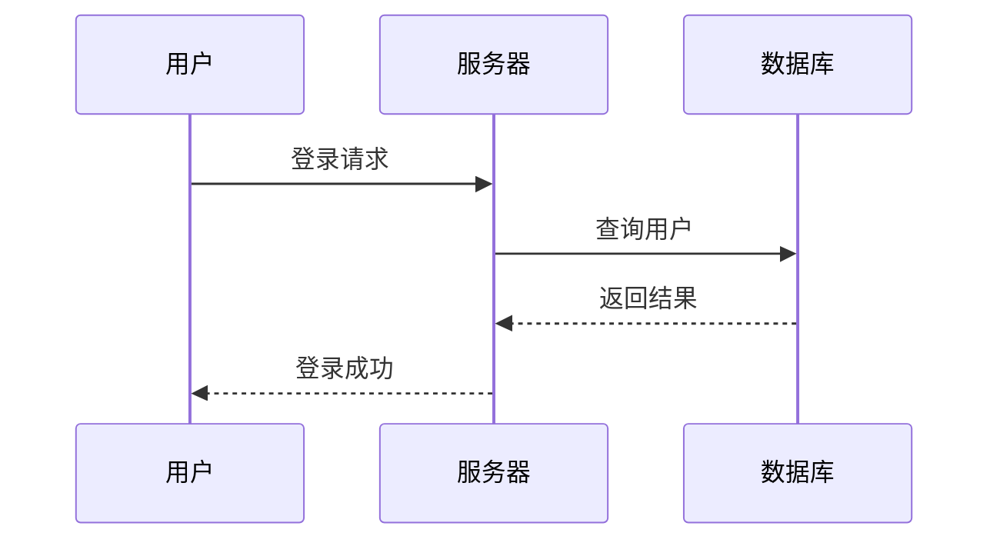
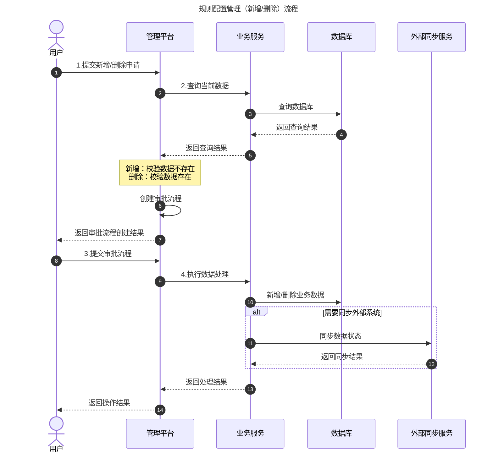

# Markdown Mermaid

Mermaid 是一种文本格式，它可以将文本转换为图表。它使用类似 Markdown 的文字描述方式，自动生成流程图、时序图、类图、甘特图等图表。

Mermaid 和 Markdown 的关系：
Mermaid 不是 Markdown 的一部分。Markdown 主要负责文字格式，而 Mermaid 是 Markdown 的扩展语法，用于生成图表。

如何使用：
在 Markdown 文档中嵌入 Mermaid，需要使用 ` ```mermaid ` 开头，` ``` ` 结尾，中间放入 Mermaid 语句。
例如：





Mermaid 是谁开发的？
Mermaid 是一个开源 JavaScript 项目，最初目的是：
> 让开发者可以像写代码一样创建图表。
它现在支持：
- 流程图（Flowchart）
- 时序图（Sequence Diagram）
- 类图（Class Diagram）
- 状态图（State Diagram）
- ER 图
- 甘特图
- Git 图
- 用户旅程图

